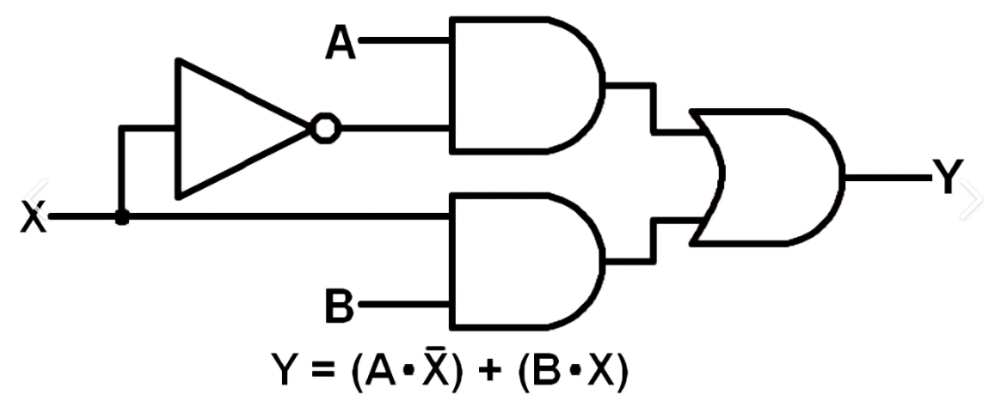
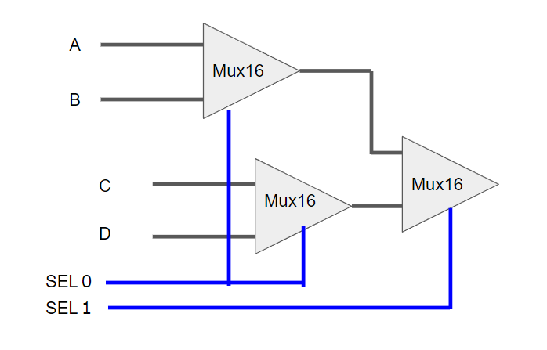

Este readme pertenece a la práctica No. 1 del curso de "nand2tetris", la cual nos pide hacer un conjunto amplio de compuertas lógicas a partir de la compuerta lógica "NAND" o "AND NOT". El siguiente texto describe de que
manera cada uno de los participantes del grupo S13T3 realizó la lógica de su compuerta correspondiente:

Andrés Felipe Muñoz Aguilar

- NOT: Primero tomé la propiedad del algebra booleana que dice: A = A + A; entonces, vamos a ver si con "~A" (A negado) se cumple esta condición: 

|  $A$  |  $\neg A$  |   $\neg A + \neg A$   |
| :-:| :-: | :-:|
|  0  |   1  |  1 + 1 = 1  |
|  1  |   0  |  0 + 0 = 0  |

Vemos que, efectivamente, $\neg A = (\neg A) + (\neg A)$, entonces, a partir de ahí, desarrollé, a través de la Ley de Demorgan una expresión para convertir la compuerta "OR" en una compuerta "Nand". Esta es: (~A) + (~A) 
-- aplico DeMorgan  -->  $\neg [ (A) * (A) ]$ Entonces, vemos que: $\neg A = \neg [ (A) * (A) ]$ o, lo que es igual, una compuerta and cuyas entradas son la variable A. Y eso fue lo que programé en el hdl de la compuerta "Not"

- Compuerta Or: Empecé con la expresión $"A + B"$, tras esto, le apliqué la Ley de DeMorgan, resultando: $\neg [ (\neg A) * (\neg B) ]$ y, como ya había hecho la función "Not" con cumpuertas "Nand" anteriormente, aproveché ese código
y lo usé en esta compuerta. Finalmente, lo que escribí en el hdl de la compuerta or fue una compuerta Nand cuyas entradas son, respectivamente: Not(a) y Not(b) 

- Compuerta And: Como ya tengo el progrmado el funcionamiento de la compuerta "Or" y la compuerta "Not" en función de compuertas "Nand", ahora, puedo usar esas compuertas para programar la lógica de la compuerta "And".
Para esto empecé con la expresión "A * B" y le apliqué DeMorgan, resultando: $" \neg [ (\neg A) + (\neg B) ]"$ y esta última expresión de acá fue la que programé en "And.hdl"

- Compuerta Xor: Esta compuerta fue fácil de programar, pues, todo lo que tuve que buscar fue la definición de la compuerta Xor a través de compuertas básicas. Esta se define así: $A ⊕ B$ = $[ (A) * (\neg B) ] + [ (\neg A) * (B) ]$
entonces, esto último fue lo que programé en el hdl de la compuerta Xor. Entonces, negué la entrada "A" y la entrada "B"; luego, uní $"A" y "\neg B"$ a través de una compuerta And (Que ya había hecho, a base de compuertas
Nand); hice lo mismo con las variables $"\neg A" , "B"$ y, finalmente, uní ambas compuertas anteriores a través de la compuerta Or.
<br>
<br>
<br>



> imagen de un Mux

- Mux: Se desarrollo por caminos, primero para la entrada A y luego para el endrada B.

Para el camino de A lo primero es negar el selector(sel):
```
Not(in=sel, out=notsel);
```
Seguido pasamos al And, que tiene 2 entradas, A y sel
```
And(a=a, b=notsel, out=aAndnotsel);
```
Notese que b=notsel, osea a la negación de selector después de haber pasado por el Not.

Hasta ahí ya se tendría todo el camino de A.

B es en esencia el mismo camino solamente que no es necesario negar el selector dando como resultado la siguiente linea:
```
And(a=sel, b=b, out=bAndsel);
```
Finalmente se hace el Or entre AandNotSel y BandSel:
```
Or(a=aAndnotsel, b=bAndsel, out=out);
```

- Or16: Para el caso del Or16 este simplemente es un Or, tiene 2 entradas cada una de 16 bits y 1 salida de 16 bits.

Y ya que simplemente es ejecutar un Or para cada par se llego a la siguiente linea:
```
 Or(a=a[n], b=b[n], out=out[n]);
``` 
Esta linea se repitio 16 veces reemplazando en cada una con valores de 0 a 15. 

- Mux16: El proceso es el mismo que el Or16, también posee 2 entradas cada una de 16 bits y 1 salida de 16 bits. Usamos Mux 16 veces tal como se hizo en Or16.
```
Mux(a=a[n], b=b[n], sel=sel, out=out[n]);
```

> imagen de un Mux4Way16
- Mux4Way16: Posee 4 entradas cada entradas de 16 bits, posee 1 selector de 2 bits y una salida de 16 bits.
  Como se puede apreciar en la imagen esta compuesto de 3 Mux16.
<br>
Un Mux16 se usara para las entradas A y B con el selector[0] y se usara el segundo Mux16 para las entradas C y D con el selector[0] también. Finalmente al resultado de hacer Mux16 entre A y B y al resultado de hacer Mux16 entre C y D se aplica otro Mux16 con el selector[1]:
```
    Mux16(a=a, b=b, sel=sel[0], out=ab);
    Mux16(a=c, b=d, sel=sel[0], out=cd);
    Mux16(a=ab, b=cd, sel=sel[1], out=out);
```
